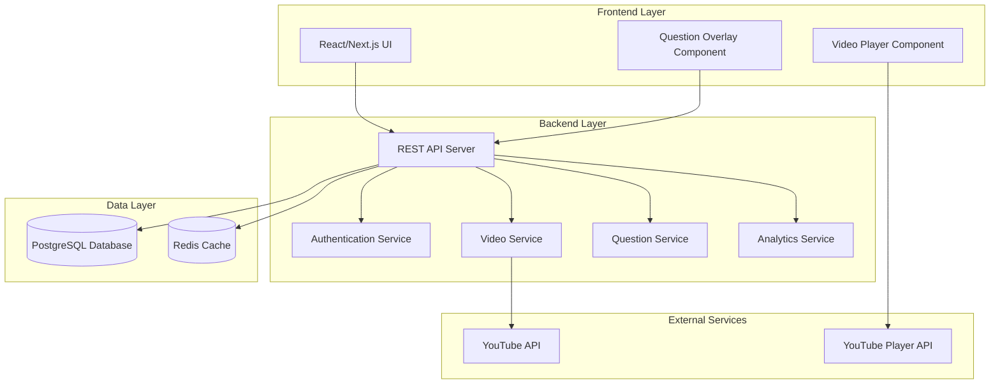

# Design Document

## Overview

The Interactive Video Quiz platform is a web-based application that enables teachers to create engaging video lessons by embedding questions at specific timestamps in YouTube videos. The system provides a seamless experience for both content creation (teachers) and consumption (students), with real-time question overlays, progress tracking, and comprehensive analytics.

## Architecture

### System Architecture

The application follows a modern web architecture with clear separation of concerns:



### Technology Stack

- **Frontend**: React with Next.js for server-side rendering and optimal performance
- **Backend**: Node.js with Express.js for RESTful API (optional - can use Firebase Functions)
- **Database**: Firebase Firestore for NoSQL document storage
- **Authentication**: Firebase Authentication with role-based access control
- **Real-time**: Firebase Realtime Database for live progress tracking
- **Storage**: Firebase Storage for any file uploads
- **Video Integration**: YouTube Player API for embedded video control

## Components and Interfaces

### Core Components

#### 1. Video Player Component
- **Purpose**: Manages YouTube video playback and question synchronization
- **Key Features**:
  - YouTube Player API integration
  - Timestamp tracking and question triggering
  - Playback control restrictions based on teacher settings
  - Progress saving and resume functionality

#### 2. Question Overlay Component
- **Purpose**: Displays interactive questions over video content
- **Key Features**:
  - Modal-style question presentation
  - Support for multiple question types (multiple choice, true/false, short answer)
  - Real-time answer validation and feedback
  - Smooth transitions and animations

#### 3. Teacher Dashboard Component
- **Purpose**: Content creation and management interface for teachers
- **Key Features**:
  - Video URL input and validation
  - Question creation with timestamp selection
  - Assignment management and student progress tracking
  - Analytics and reporting views

#### 4. Student Interface Component
- **Purpose**: Streamlined learning experience for students
- **Key Features**:
  - Assignment list and progress tracking
  - Video playback with embedded questions
  - Response history and performance summary

### API Interfaces

#### Authentication Endpoints
```
POST /api/auth/login
POST /api/auth/register
POST /api/auth/logout
GET /api/auth/profile
```

#### Video Management Endpoints
```
POST /api/videos - Create interactive video
GET /api/videos/:id - Get video details
PUT /api/videos/:id - Update video
DELETE /api/videos/:id - Delete video
GET /api/videos/teacher/:teacherId - Get teacher's videos
```

#### Question Management Endpoints
```
POST /api/videos/:videoId/questions - Add question to video
PUT /api/questions/:id - Update question
DELETE /api/questions/:id - Delete question
GET /api/videos/:videoId/questions - Get all questions for video
```

#### Assignment Endpoints
```
POST /api/assignments - Create assignment
GET /api/assignments/teacher/:teacherId - Get teacher assignments
GET /api/assignments/student/:studentId - Get student assignments
POST /api/assignments/:id/responses - Submit student responses
GET /api/assignments/:id/analytics - Get assignment analytics
```

## Data Models

### Firestore Collections Structure

#### Users Collection (`users`)
```javascript
{
  uid: "firebase_auth_uid", // Firebase Auth UID
  email: "user@example.com",
  role: "teacher" | "student",
  firstName: "John",
  lastName: "Doe",
  createdAt: Timestamp,
  updatedAt: Timestamp
}
```

#### Interactive Videos Collection (`videos`)
```javascript
{
  id: "auto_generated_id",
  teacherId: "teacher_uid",
  title: "Video Title",
  description: "Video description",
  youtubeUrl: "https://youtube.com/watch?v=...",
  youtubeVideoId: "video_id",
  duration: 300, // in seconds
  settings: {
    allowSkip: true,
    preventFastForward: false,
    // other playback settings
  },
  createdAt: Timestamp,
  updatedAt: Timestamp
}
```

#### Questions Subcollection (`videos/{videoId}/questions`)
```javascript
{
  id: "auto_generated_id",
  timestamp: 120, // in seconds
  questionType: "multiple_choice" | "true_false" | "short_answer",
  questionText: "What is the main topic?",
  options: {
    a: "Option A",
    b: "Option B",
    c: "Option C",
    d: "Option D"
  }, // for multiple choice
  correctAnswer: "a",
  explanation: "Explanation text",
  isRequired: true,
  showFeedback: true,
  createdAt: Timestamp
}
```

#### Assignments Collection (`assignments`)
```javascript
{
  id: "auto_generated_id",
  videoId: "video_document_id",
  teacherId: "teacher_uid",
  title: "Assignment Title",
  description: "Assignment description",
  dueDate: Timestamp,
  maxAttempts: 1,
  studentIds: ["student_uid1", "student_uid2"],
  createdAt: Timestamp
}
```

#### Student Responses Subcollection (`assignments/{assignmentId}/responses`)
```javascript
{
  id: "auto_generated_id",
  studentId: "student_uid",
  questionId: "question_id",
  responseText: "Student's answer",
  isCorrect: true,
  attemptNumber: 1,
  responseTime: Timestamp
}
```

#### Video Progress Subcollection (`assignments/{assignmentId}/progress`)
```javascript
{
  id: "student_uid", // Use student ID as document ID
  studentId: "student_uid",
  currentTimestamp: 150, // current position in seconds
  completedAt: Timestamp | null,
  totalTimeWatched: 200, // total time spent watching
  createdAt: Timestamp,
  updatedAt: Timestamp
}
```

### Firestore Security Rules Structure
```javascript
rules_version = '2';
service cloud.firestore {
  match /databases/{database}/documents {
    // Users can read/write their own profile
    match /users/{userId} {
      allow read, write: if request.auth != null && request.auth.uid == userId;
    }
    
    // Videos - teachers can CRUD their own, students can read assigned
    match /videos/{videoId} {
      allow read, write: if request.auth != null && 
        resource.data.teacherId == request.auth.uid;
      allow read: if request.auth != null && 
        request.auth.token.role == 'student';
    }
    
    // Questions - same as videos
    match /videos/{videoId}/questions/{questionId} {
      allow read, write: if request.auth != null && 
        get(/databases/$(database)/documents/videos/$(videoId)).data.teacherId == request.auth.uid;
      allow read: if request.auth != null && 
        request.auth.token.role == 'student';
    }
    
    // Assignments - teachers can CRUD their own, students can read assigned
    match /assignments/{assignmentId} {
      allow read, write: if request.auth != null && 
        resource.data.teacherId == request.auth.uid;
      allow read: if request.auth != null && 
        request.auth.uid in resource.data.studentIds;
    }
    
    // Responses - students can write their own, teachers can read
    match /assignments/{assignmentId}/responses/{responseId} {
      allow write: if request.auth != null && 
        request.auth.uid == resource.data.studentId;
      allow read: if request.auth != null && (
        request.auth.uid == resource.data.studentId ||
        get(/databases/$(database)/documents/assignments/$(assignmentId)).data.teacherId == request.auth.uid
      );
    }
    
    // Progress - students can read/write their own, teachers can read
    match /assignments/{assignmentId}/progress/{studentId} {
      allow read, write: if request.auth != null && 
        request.auth.uid == studentId;
      allow read: if request.auth != null && 
        get(/databases/$(database)/documents/assignments/$(assignmentId)).data.teacherId == request.auth.uid;
    }
  }
}
```

## Error Handling

### Client-Side Error Handling
- **Network Errors**: Retry mechanisms with exponential backoff
- **Validation Errors**: Real-time form validation with user-friendly messages
- **Video Loading Errors**: Fallback UI with error reporting
- **Authentication Errors**: Automatic redirect to login with session restoration

### Server-Side Error Handling
- **Input Validation**: Comprehensive request validation using middleware
- **Database Errors**: Transaction rollback and error logging
- **External API Errors**: YouTube API error handling with graceful degradation
- **Rate Limiting**: API rate limiting to prevent abuse

### Error Response Format
```json
{
  "success": false,
  "error": {
    "code": "VALIDATION_ERROR",
    "message": "Invalid video URL provided",
    "details": {
      "field": "youtube_url",
      "reason": "URL must be a valid YouTube video link"
    }
  }
}
```

## Testing Strategy

### Unit Testing
- **Frontend Components**: React Testing Library for component behavior
- **API Endpoints**: Jest for business logic and endpoint functionality
- **Database Models**: Test database operations and constraints
- **Utility Functions**: Comprehensive coverage of helper functions

### Integration Testing
- **API Integration**: End-to-end API workflow testing
- **Database Integration**: Test complex queries and transactions
- **YouTube API Integration**: Mock external API calls for reliable testing
- **Authentication Flow**: Complete user authentication and authorization testing

### End-to-End Testing
- **User Workflows**: Playwright for complete user journey testing
- **Cross-Browser Testing**: Ensure compatibility across major browsers
- **Mobile Responsiveness**: Test on various device sizes and orientations
- **Performance Testing**: Load testing for concurrent users and video streaming

### Testing Environment Setup
- **Test Database**: Isolated PostgreSQL instance for testing
- **Mock Services**: YouTube API mocking for consistent test results
- **CI/CD Pipeline**: Automated testing on code commits and deployments
- **Test Data Management**: Seed data and cleanup procedures for reliable tests